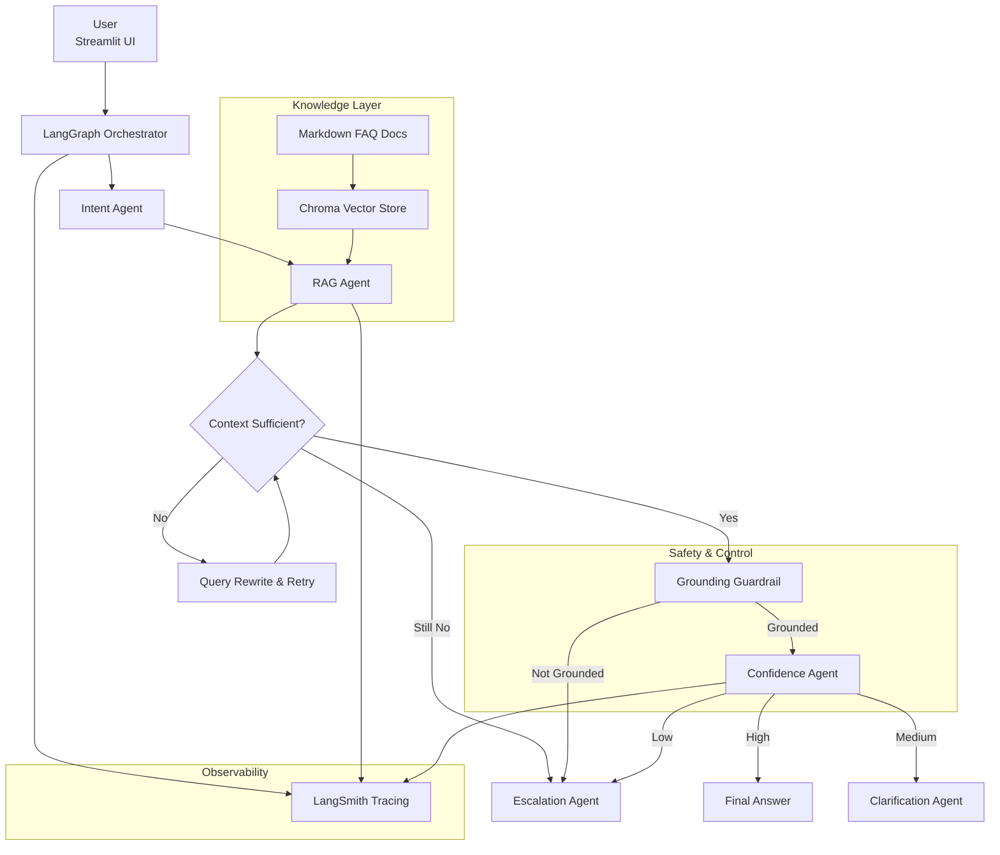

# 🧠 Autonomous Customer Support AI  
**LangGraph · RAG · Guardrails · LangSmith**

## Overview

This project is a **production-grade autonomous customer support system** built using **LangGraph** and **Retrieval-Augmented Generation (RAG)**.

Unlike basic chatbots, this system focuses on:
- deterministic multi-agent control flow
- strict grounding to documentation
- hallucination prevention
- prompt-injection resilience
- confidence-based escalation
- full observability using LangSmith

The goal is **safe, reliable AI behavior**, not just fluent responses.

---

## Key Capabilities

- Multi-agent orchestration with LangGraph
- Chroma-based RAG with persistent embeddings
- Query rewriting and retrieval fallback
- Hallucination detection and blocking
- Prompt-injection guardrails
- Confidence-based routing (answer / clarify / escalate)
- End-to-end tracing and observability with LangSmith
- Evaluation-driven system validation

---

## System Architecture



---

## Design Principle

**LLMs never control system behavior.**  
All routing, escalation, and safety decisions are enforced in Python.

---

## Project Structure

```
customer-support-ai/
│
├── app/
│   ├── main.py
│   ├── core/
│   │   ├── state.py
│   │   └── graph.py
│   ├── agents/
│   │   ├── intent_agent.py
│   │   ├── rag_agent.py
│   │   ├── confidence_agent.py
│   │   ├── clarification_agent.py
│   │   ├── escalation_agent.py
│   │   ├── grounding_guard.py
│   │   └── injection_guard.py
│   ├── rag/
│   │   └── retriever.py
│   └── config.py
│
├── data/docs/
├── chroma_db/
├── notebooks/evaluation.ipynb
├── eval_dataset.json
├── requirements.txt
└── README.md
```

---

## Knowledge Base (RAG)

FAQ knowledge is stored as Markdown files with structured sections:
- Category
- Problem
- Solution
- Notes
- Keywords

This structure improves retrieval quality and reduces hallucination risk.

---

## Agents Overview

- **Intent Agent** – classifies query domain  
- **RAG Agent** – retrieves documents and generates grounded answers  
- **Grounding Guard** – blocks unsupported answers  
- **Confidence Agent** – controls tone and routing  
- **Clarification Agent** – asks follow-ups  
- **Escalation Agent** – safe fallback for risky cases  

---

## Prompt Injection Defense

- Pattern-based injection detection
- Context sanitization
- Immutable Python-controlled routing

Prompt injection attempts result in clarification or escalation, never unsafe answers.

---

## Evaluation

Evaluation is done using a labeled dataset and Jupyter notebook.  
Metrics include:
- Recall@K
- Routing accuracy
- Missed escalation rate
- Hallucination rate
- Confidence calibration

---

## LangSmith Observability

LangSmith provides:
- full LangGraph traces
- agent-level visibility
- retrieval inspection
- evaluation run comparison

---

## Running the App

```bash
pip install -r requirements.txt
streamlit run app/main.py
```
